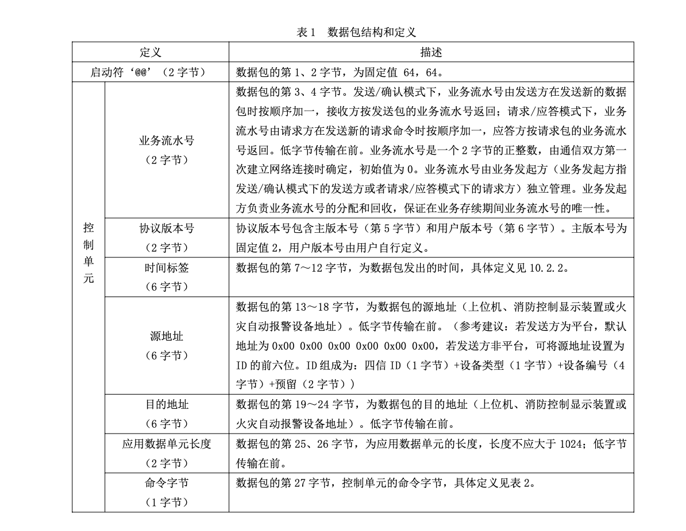

#文档阅读说明
##城市消防远程监控系统协议
**报文协议**
**定义四信盒子与firemapper之间的通讯协议。整体协议格式如下图所示，每个字节详细详细定义内容阅读协议文档**

##四信消防电气火灾终端接入流程
**四信盒子和协议说明**
**定义说明四信盒子接入与配置信息**

##消防映射点位设计
**说明cmdb设备信息与firemapper解析报文后的内容关系，建立映射对照表**

##M5三层 ECC消防主机接打印机告警
**说明和示例通过消防主机的打印机通过PRT模式接入。
