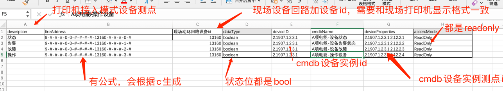
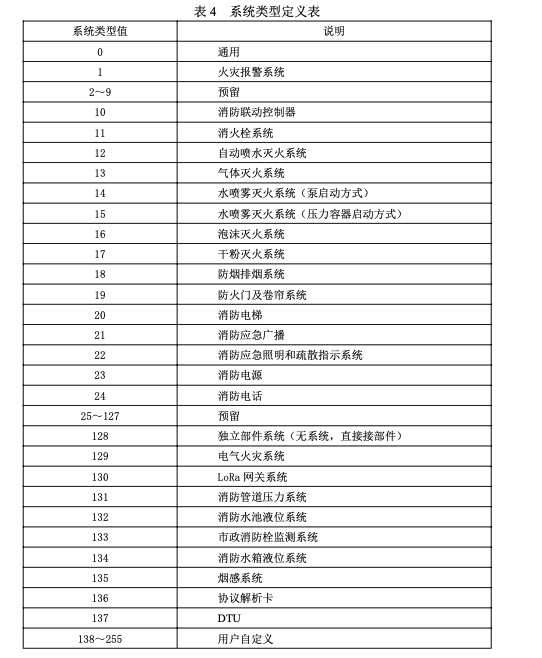

# 消防接入方式点位设计
## 标准打印机接入消防协议点表配置



## 消防映射点位设计原理

|位| 标准点位名称 |示例  |
|---|---|---|
| 空 | #-#-#-#-#-#-#-#-#-#-#-#-#-#-#-# |
｜0 | 数据单元标识符 | n-#-#-#-#-#-#-#-#-#-#-#-#-#-#-# |
｜1 | 系统类型代码 | #-n-#-#-#-#-#-#-#-#-#-#-#-#-#-# |
｜2 | 系统地址| #-#-n-#-#-#-#-#-#-#-#-#-#-#-#-# |
｜3 | 通道类型（选用，配合 8.1.1 类型标志 130 使用）| #-#-#-n-#-#-#-#-#-#-#-#-#-#-#-#  |
｜4 | 通道号（选用，配合 8.1.1 类型标志 130 使用） |  #-#-#-#-n-#-#-#-#-#-#-#-#-#-#-# |
｜5 | 消控主机编号部件类型，或设备名称 | #-#-#-#-#-n-#-#-#-#-#-#-#-#-#-# |
｜6 | 部件类型 设备名称 |#-#-#-#-#-n-#-#-#-#-#-#-#-#-#-#   |
｜7 | 部件地址，或设备位置 | #-#-#-#-#-#-n-#-#-#-#-#-#-#-#-# |
｜8 | 部件通道类型（选用，配合 8.1.1 类型标志 131 使用） | #-#-#-#-#-#-#-n-#-#-#-#-#-#-#-# |
｜9 | 部件通道号（选用，配合 8.1.1 类型标志 131 使用） | #-#-#-#-#-#-#-#-n-#-#-#-#-#-#-# |
｜10 | 设备编号 | #-#-#-#-#-#-#-#-#-#-n-#-#-#-#-# |
｜11 | 电能周期| #-#-#-#-#-#-#-#-#-#-#-n-#-#-#-# |
｜12 | 电能序号 | #-#-#-#-#-#-#-#-#-#-#-#-n-#-#-# |
｜13 | 电能类型 | #-#-#-#-#-#-#-#-#-#-#-#-#-n-#-#  |
｜14 | 状态位 | #-#-#-#-#-#-#-#-#-#-#-#-#-#-n-#  |
｜15 | 模拟量类型 | #-#-#-#-#-#-#-#-#-#-#-#-#-#-#-n  |


## 示例 1

### 上传消控主机解析卡PRT报警字符串

#### **实例1**-电源:13160

##### 打印机小票上打印信息：
```
00楼04层00房间  
22/06/08 11:31:01
电源    
反馈:13160 
低压２
```
##### 消防主机打印机输出信息
**打印机会传给四信的打印机报文：字符串部分编码采用是GB3212或GB或GB1803编码。
暂时看不出来什么区别**，
```
1B 40 1B 31 05 1B 36 1B 39
32 32 2F 30 36 2F 30 38 20 31 31 3A 33 31 3A 30 31 0A 
30 30 C2 A5 30 34 B2 E3 30 30 B7 BF BC E4 0A 
20 20 20 20 20 20 20 20 20 20 0A 
B5 CD D1 B9 A3 B2 00 00 00 00 00 00 0A 
B7 B4 C0 A1 3A 31 33 31 36 30 0A 
B5 E7 D4 B4 0A 
1B 4A 01 1B 39
```

##### 四信解码组包数据
```
[2022-09-23 16:21:06.051] type = 09
[2022-09-23 16:21:06.051] name[10] = 电源:13160
[2022-09-23 16:21:06.052] pos[30] = 低压２          00楼04层00房间
[2022-09-23 16:21:06.052] info[4] = 反馈
[2022-09-23 16:21:06.052] time = 2022-06-08 11:31:01
```

##### Firemapper收到城市消防协议PRT数据包：
```
40 40 16 00 02 03 02 18 10 17 09 16 58 13 97 10
A1 FF 00 00 00 00 00 00 3C 00 02 09 01 00 05 33
33 
09 
0A B5 E7 D4 B4 3A 31 33 31 36 30 
1E B5 CD D1 B9 A3 B2 20 20 20 20 20 20 20 20 20 20 30 30 C2 A5 30 34 B2 E3 30 30 B7 BF BC E4 
04 B7 B4 C0 A1 
01 1F 0B 08 06 16 
60 23 23
```

##### Firemapper解析出来告警信息
```
告警位：0x09
设备名称：
长度10(0x0A): 
B5 E7 D4 B4 3A 31 33 31 36 30
明文：电源:13160
告警位置信息：
长度30(0x1E): 
B5 CD D1 B9 A3 B2 20 20 20 20 20 20 20 20 20 20 30 30 C2 A5 30 34 B2 E3 30 30 B7 BF BC E4
明文：低压2 00楼04层00房间
告警信息：
长度4（0x04): B7 B4 C0 A1
明文: 反馈 
```
##### 目前接入的消防主机打印机信息，所以Firemapper解析出来告警信息内容和打印一样对应的映射信息
##### 根据打印机消防协议会产生报警，类型状态字段会生成0，1，2，3 四个开关量
##### 根据打印机消防协议，告警会产生告警消息内容，会生成一个消息映射信息9-#-#-#-0-0-#-#-#-#-设备编码-#-#-#-#-s
##### 消防主机PRT消息解析出来的映射点位
| 标准点位名称 |示例  |值|
|---|---|---|
| 状态 |9-#-#-#-0-0-#-#-#-#-13160-#-#-#-0-#  |true|
| 告警 |9-#-#-#-0-0-#-#-#-#-13160-#-#-#-1-#  |false|
| 故障 |9-#-#-#-0-0-#-#-#-#-13160-#-#-#-2-#  |false|
| 操作 |9-#-#-#-0-0-#-#-#-#-13160-#-#-#-3-#  |true|
| 信息 |9-#-#-#-0-0-#-#-#-#-13160-#-#-#-s-#  |反馈|

## 示例 2

### 上传消控主机解析卡PRT报警字符串

#### **实例2**-电源:13160

##### 打印机小票上打印信息：
```
 00楼05层00房间
23/03/21 17:17:02
西走道北   
火警:09144
信号阀
```
##### 消防主机打印机输出信息
**打印机会传给四信的打印机报文：字符串部分编码采用是GB3212或GB或GB1803编码。
暂时看不出来什么区别**，
```
1B 40 1B 31 05 1B 36 1B 39 32 33 2F 30 33 2F 32
31 20 31 37 3A 31 37 3A 30 32 0A 30 30 C2 A5 30 
35 B2 E3 30 30 B7 BF BC E4 0A CE F7 D7 DF B5 C0 
B1 B1 0A BB F0 BE AF 3A 30 39 31 34 34 0A D0 C5
BA C5 B7 A7 0A 1B 4A 01 1B 39
```

##### 四信解码组包数据
```
[2022-09-23 16:21:06.051] type = 03
[2022-09-23 16:21:06.051] name[10] = 信号阀:09144
[2022-09-23 16:21:06.052] pos[30] = 西走道北          00楼05层00房间
[2022-09-23 16:21:06.052] info[4] = 火警
[2022-09-23 16:21:06.052] time = 2023-03-21 17:17:02
```

##### Firemapper收到城市消防协议PRT数据包：
```
40 40 
02 00 
02 03 
39 0E 0E 0C 04 17 
58 13 97 10 A1 FF
00 00 00 00 00 00 
36 00 
02 
09 
01 
00 
00 
33 33 
03 
0C D0 C5 BA C5 B7 A7 3A 30 39 31 34 34 
16 CE F7 D7 DF B5 C0 B1 B1 30 30 C2 A5 30 35 B2 E3 
30 30 B7 BF BC E4
04 BB F0 BE AF 
02 11 11 15 03 17 
A8 
23 23 
```

##### Firemapper解析出来告警信息
```
告警位：0x03
设备名称：
长度12(0x0C): 
D0 C5 BA C5 B7 A7 3A 30 39 31 34 34 
明文：信号阀:09144
告警位置信息：
长度22(0x16): 
CE F7 D7 DF B5 C0 B1 B1 30 30 C2 A5 30 35 B2 E3
明文：西走道北00楼05层00房间
告警信息：
长度4（0x04): BB F0 BE AF 
明文: 火警
```
##### 目前接入的消防主机打印机信息，所以Firemapper解析出来告警信息内容和打印一样对应的映射信息
##### 根据打印机消防协议会产生报警，类型状态字段会生成0，1，2，3 四个开关量
##### 根据打印机消防协议，告警会产生告警消息内容，会生成一个消息映射信息9-#-#-#-0-0-#-#-#-#-设备编码-#-#-#-#-s
##### 消防主机PRT消息解析出来的映射点位
| 标准点位名称 |示例  |值|
|---|---|---|
| 状态 |9-#-#-#-0-0-#-#-#-#-09144-#-#-#-0-#  |true|
| 告警 |9-#-#-#-0-0-#-#-#-#-09144-#-#-#-1-# |false|
| 故障 |9-#-#-#-0-0-#-#-#-#-09144-#-#-#-2-#  |false|
| 操作 |9-#-#-#-0-0-#-#-#-#-09144-#-#-#-3-#  |true|
| 信息 |9-#-#-#-0-0-#-#-#-#-09144-#-#-#-s-#  |火警|

#### **实例3**-电源:13160

##### 打印机小票上打印信息：
```
00楼04层00房间
DC22冷通
22/06/08 11:34:08   
反馈:13187
电源
```
##### 消防主机打印机输出信息
**打印机会传给四信的打印机报文：字符串部分编码采用是GB3212或GB或GB1803编码。
暂时看不出来什么区别**，
```
1B 40 1B 31 05 1B 36 1B 39 
32 32 2F 30 36 2F 30 38 20 31 31 3A 33 34 3A 30 38 0A 
30 30 C2 A5 30 34 B2 E3 30 30 B7 BF BC E4 0A 
20 20 20 20 20 20 20 20 20 20 0A 
A3 C4 A3 C3 A3 B2 A3 B2 C0 E4 CD A8 0A B7 B4 C0 A1 3A 31 33 31 38 37 0A 
B5 E7 D4 B4 0A 
1B 4A 01 1B 39
```

##### 四信解码组包数据
```
[2022-09-23 16:21:06.051] type = 09
[2022-09-23 16:21:06.051] name[10] = 电源:13187
[2022-09-23 16:21:06.052] pos[30] = ＤＣ２２冷通00楼04层00房间
[2022-09-23 16:21:06.052] info[4] = 反馈
[2022-09-23 16:21:06.052] time = 2022-06-08 11:34:08
```

##### Firemapper收到城市消防协议PRT数据包：
```
40 40 
04 00 
02 03 
1D 1C 0F 0C 04 17 
58 13 97 10 A1 FF
00 00 00 00 00 00
42 00 
02 
09 
01 
00 
00 
33 33 
09 
0A B5 E7 D4 B4 3A 31 33 31 38 37 
24 A3 C4 A3 C3 A3 B2 A3 B2 C0 E4 CD A8 20 20 20 20 20 20 20 20 20 20 30 30 C2 A5 30 34 B2 E3 30 30 B7 BF
BC E4 
04 B7 B4 C0 A1 
08 22 0B 08 06 16 
A6 
23 23 
```

##### Firemapper解析出来告警信息
```
告警位：0x09
设备名称：
长度10(0x0A): 
B5 E7 D4 B4 3A 31 33 31 38 37  
明文：信号阀:09144
告警位置信息：
长度36(0x24): 
A3 C4 A3 C3 A3 B2 A3 B2 C0 E4
CD A8 20 20 20 20 20 20 20 20 
20 20 30 30 C2 A5 30 34 B2 E3
30 30 B7 BF BC E4
明文：西走道北00楼05层00房间
告警信息：
长度4（0x04): B7 B4 C0 A1  
明文: 反馈
```
##### 目前接入的消防主机打印机信息，所以Firemapper解析出来告警信息内容和打印一样对应的映射信息
##### 根据打印机消防协议会产生报警，类型状态字段会生成0，1，2，3 四个开关量
##### 根据打印机消防协议，告警会产生告警消息内容，会生成一个消息映射信息9-#-#-#-0-0-#-#-#-#-设备编码-#-#-#-#-s
##### 消防主机PRT消息解析出来的映射点位
| 标准点位名称 |示例  |值|
|---|---|---|
| 状态 |9-#-#-#-0-0-#-#-#-#-13187-#-#-#-0-#-  |true|
| 告警 |9-#-#-#-0-0-#-#-#-#-13187-#-#-#-1-# |false|
| 故障 |9-#-#-#-0-0-#-#-#-#-13187-#-#-#-2-#  |false|
| 操作 |9-#-#-#-0-0-#-#-#-#-13187-#-#-#-3-#  |true|
| 信息 |9-#-#-#-0-0-#-#-#-#-13187-#-#-#-s-#  |反馈|

## 数据单元标识符


## 系统类型



## 部件类型


