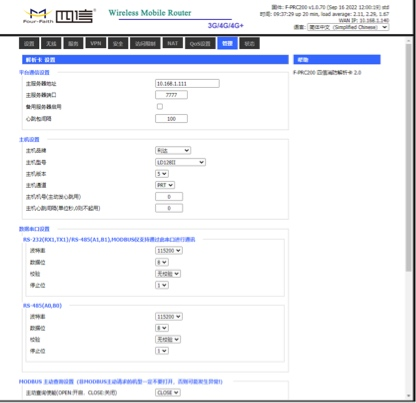
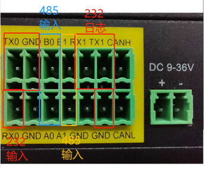

# M5三层 ECC消防主机接打印机告警
如下图所示：  
##1.通过四信F200的wifi连接到盒子。 样机wifi和admin登陆密码都是:ff123456
##2.进入解析卡配置界面

###2.1 配置平台通讯设置，边缘消防maaper的节点主机地址和端口号 如下图
###2.2 选择消防主机厂家-》消防主机型号-》主机版本-》主机通道 如下图 

 

###2.3 串口输出配置和模拟输入配置

## 实例1-电源:13160
### 打印机小票上打印信息：
00楼04层00房间  
22/06/08 11:31:01
电源    
反馈:13160
低压２

### 消防主机打印机输出信息
**打印机会传给四信的打印机报文：字符串部分编码采用是GB3212或GB或GB1803编码。
暂时看不出来什么区别**，
```
1B 40 1B 31 05 1B 36 1B 39
32 32 2F 30 36 2F 30 38 20 31 31 3A 33 31 3A 30 31 0A 
30 30 C2 A5 30 34 B2 E3 30 30 B7 BF BC E4 0A 
20 20 20 20 20 20 20 20 20 20 0A 
B5 CD D1 B9 A3 B2 00 00 00 00 00 00 0A 
B7 B4 C0 A1 3A 31 33 31 36 30 0A 
B5 E7 D4 B4 0A 
1B 4A 01 1B 39
```

### 四信解码组包数据
```
[2022-09-23 16:21:06.051] type = 09
[2022-09-23 16:21:06.051] name[10] = 电源:13160
[2022-09-23 16:21:06.052] pos[30] = 低压２          00楼04层00房间
[2022-09-23 16:21:06.052] info[4] = 反馈
[2022-09-23 16:21:06.052] time = 2022-06-08 11:31:01
```

### Firemapper收到城市消防协议PRT数据包：
```
40 40 16 00 02 03 02 18 10 17 09 16 58 13 97 10
A1 FF 00 00 00 00 00 00 3C 00 02 09 01 00 05 33
33 
09 
0A B5 E7 D4 B4 3A 31 33 31 36 30 
1E B5 CD D1 B9 A3 B2 20 20 20 20 20 20 20 20 20 20 30 30 C2 A5 30 34 B2 E3 30 30 B7 BF BC E4 
04 B7 B4 C0A1 
01 1F 0B 08 06 16 
60 23 23
```

### Firemapper解析出来告警信息
```
告警位：0x09
设备名称：
长度10(0x0A): 
B5 E7 D4 B4 3A 31 33 31 36 30
明文：电源:13160
告警位置信息：
长度30(0x1E): 
B5 CD D1 B9 A3 B2 20 20 20 20 20 20 20 20 20 20 30 30 C2 A5 30 34 B2 E3 30 30 B7 BF BC E4
明文：低压2 00楼04层00房间
告警信息：
长度4（0x04): B7 B4 C0 A1
明文: 反馈 
```
### Firemapper解析出来告警信息对应的映射信息
根据报警类型状态0x09会生成0，1，2，3 四个开关量

### 根据告警消息内容会生成一个消息s
```
I0926 10:18:19.350374   58178 firecustomizeddata.go:36] DData.Properties: 9-#-#-#-0-5-#-#-#-#-13160-#-#-#-0-#-----&{false {1654659247 boolean}}
I0926 10:18:19.350460   58178 firecustomizeddata.go:36] DData.Properties: 9-#-#-#-0-5-#-#-#-#-13160-#-#-#-1-#-----&{true {1654659247 boolean}}
I0926 10:18:19.350493   58178 firecustomizeddata.go:36] DData.Properties: 9-#-#-#-0-5-#-#-#-#-13160-#-#-#-s-#-----&{反馈 {1654659247 string}}
I0926 10:18:19.350519   58178 firecustomizeddata.go:36] DData.Properties: 9-#-#-#-0-5-#-#-#-#-13160-#-#-#-2-#-----&{true {1654659247 boolean}}
I0926 10:18:19.350543   58178 firecustomizeddata.go:36] DData.Properties: 9-#-#-#-0-5-#-#-#-#-13160-#-#-#-3-#-----&{false {1654659247 boolean}}

```
## 实例2-接口:13191
### 打印机小票上打印信息：
00楼04层00房间
22/06/08 11:34:08

接口
火警:13191
ＤＣ２２

### 消防主机打印机输出信息
**打印机会传给四信的打印机报文：字符串部分编码采用是GB3212或GB或GB1803编码。
暂时看不出来什么区别**，
```
1B 40 1B 31 05 1B 36 1B 39 
32 32 2F 30 36 2F 30 38 20 31 31 3A 33 34 3A 30 38 0A 
30 30 C2 A5 30 34 B2 E3 30 30 B7 BF BC E4 0A 
20 20 20 20 20 20 20 20 20 20 0A 
A3 C4 A3 C3 A3 B2 A3 B2 00 00 00 00 0A 
BB F0 BE AF 3A 31 33 31 39 31 0A 
BD D3 BF DA 0A 
1B 4A 01 1B 39
```

### 四信解码组包数据
```
[2022-09-23 16:21:06.051] type = 03
[2022-09-23 16:21:06.051] name[10] = 接口:13191
[2022-09-23 16:21:06.052] pos[30] = DC22          00楼04层00房间
[2022-09-23 16:21:06.052] info[4] = 火警
[2022-09-23 16:21:06.052] time = 2022-06-08 11:34:08
```

### Firemapper收到城市消防协议PRT数据包：
```
40 40 18 00 02 03 38 10 11 17 09 16 58 13 97 10
A1 FF 00 00 00 00 00 00 3E 00 02 
09 
01
00
05
33 33 
03 
0A BD D3 BF DA 3A 31 33 31 39 31 
20 A3 C4 A3 C3 A3 B2 A3 B2 20 20 20 20 20 20 20 20 20 20 30 30 C2 A5 30 34 B2 E3 30 30 B7 BF BC E4 
04 BB F0 BE AF
08 22 0B 08 06 16 
60 
23 23
```

### Firemapper解析出来告警信息
```
告警位：0x03
设备名称：
长度10(0x0A): 
BDD3BFDA3A3133313931
明文：接口:13191
告警位置信息：
长度32(0x20): 
A3C4A3C3A3B2A3B2202020202020202020203030C2A53034B2E33030B7BFBCE4
明文：ＤＣ２２00楼04层00房间
告警信息：
长度4（0x04): BBF0BEAF
明文: 火警 
```
### Firemapper解析出来告警信息对应的映射信息
根据报警类型状态0x03会生成0，1，2，3 四个开关量

### 根据告警消息内容会生成一个消息s
```
I0926 10:20:11.210391   58178 firecustomizeddata.go:36] DData.Properties: 9-#-#-#-0-5-#-#-#-#-13191-#-#-#-0-#-----&{true {1654659248 boolean}}
I0926 10:20:11.210698   58178 firecustomizeddata.go:36] DData.Properties: 9-#-#-#-0-5-#-#-#-#-13191-#-#-#-1-#-----&{true {1654659248 boolean}}
I0926 10:20:11.210729   58178 firecustomizeddata.go:36] DData.Properties: 9-#-#-#-0-5-#-#-#-#-13191-#-#-#-2-#-----&{false {1654659248 boolean}}
I0926 10:20:11.210756   58178 firecustomizeddata.go:36] DData.Properties: 9-#-#-#-0-5-#-#-#-#-13191-#-#-#-3-#-----&{false {1654659248 boolean}}
I0926 10:20:11.210780   58178 firecustomizeddata.go:36] DData.Properties: 9-#-#-#-0-5-#-#-#-#-13191-#-#-#-s-#-----&{火警 {1654659248 string}}
```

## 实例3-电源:13188
### 打印机打印信息

22/06/08 11:34:08
00楼04层00房间
          
ＳＴＯＲＯ\0\0
反馈:13188
电源


### 消防主机打印机输出信息
1B 40 1B 31 05 1B 36 1B 39 
32 32 2F 30 36 2F 30 38 20 31 31 3A 33 34 3A 30 38 0A 
30 30 C2 A5 3034 B2 E3 30 30 B7 BF BC E4 0A 
20 20 20 20 20 20 20 20 20 20 0A 
A3 D3 A3 D4 A3 CF A3 D2 A3 CF 00 00 0A 
B7 B4 C0 A1 3A 31 33 31 38 38 0A 
B5 E7 D4 B4 0A 
1B 4A 01 1B 39
### 四信解码组包数据

### Firemapper收到城市消防协议PRT数据包：
40 40 05 00 02 03 07 07 0A 17 09 16 58 13 97 10 A1 FF 00 00 00 00 00 00 40 00 02 09 01 00 05 33 33 09 0A B5 E7 D4 B4 3A 31 33 31 38 38 22 A3 D3 A3 D4 A3 CF A3 D2 A3 CF 20 20 20 20 20 20 20 20 20 20 30 30 C2 A5 30 34 B2 E3 30 30 B7 BF BC E4 04 B7 B4 C0 A1 08 22 0B 08 06 16 3E 23 23

### Firemapper解析出来告警信息
```
告警位：0x09
设备名称：
长度10(0x0A): 
B5E7D4B43A3133313838
明文：电源:13188
告警位置信息：
长度32(0x22): 
A3D3A3D4A3CFA3D2A3CF202020202020202020203030C2A53034B2E33030B7BFBCE4
明文：ＳＴＯＲＯ 00楼04层00房间
告警信息：
长度4（0x04): B7B4C0A1
明文: 反馈 
```
### Firemapper解析出来告警信息对应的映射信息
根据报警类型状态0x03会生成0，1，2，3 四个开关量

### 根据告警消息内容会生成一个消息s
```
I0926 10:29:50.631069   58178 firecustomizeddata.go:36] DData.Properties: 9-#-#-#-0-5-#-#-#-#-13160-#-#-#-0-#-----&{true {1654659248 boolean}}
I0926 10:29:50.634131   58178 firecustomizeddata.go:36] DData.Properties: 9-#-#-#-0-5-#-#-#-#-13160-#-#-#-1-#-----&{false {1654659248 boolean}}
I0926 10:29:50.634185   58178 firecustomizeddata.go:36] DData.Properties: 9-#-#-#-0-5-#-#-#-#-13160-#-#-#-2-#-----&{false {1654659248 boolean}}
I0926 10:29:50.634559   58178 firecustomizeddata.go:36] DData.Properties: 9-#-#-#-0-5-#-#-#-#-13160-#-#-#-s-#-----&{反馈 {1654659248 string}}
I0926 10:29:50.634615   58178 firecustomizeddata.go:36] DData.Properties: 9-#-#-#-0-5-#-#-#-#-13160-#-#-#-3-#-----&{true {1654659248 boolean}}


```

## 实例-4电源:13187
### 打印机打印信息

22/06/08 11:34:08
00楼04层00房间
          
ＤＣ２２冷通
反馈:13187
电源
### 消防主机打印机输出信息
```
1B 40 1B 31 05 1B 36 1B 39 
32 32 2F 30 36 2F 30 38 20 31 31 3A 33 34 3A 30 38 0A 
30 30 C2 A5 30 34 B2 E3 30 30 B7 BF BC E4 0A 
20 20 20 20 20 20 20 20 20 20 0A 
A3 C4 A3 C3 A3 B2 A3 B2 C0 E4 CD A8 0A B7 B4 C0 A1 3A 31 33 31 38 37 0A 
B5 E7 D4 B4 0A 
1B 4A 01 1B 39  
```
### 四信解码组包数据
```
[2022-09-23 16:21:06.051] type = 09
[2022-09-23 16:21:06.051] name[10] = 电源:13187
[2022-09-23 16:21:06.052] pos[30] = DC22 00楼04层00房间
[2022-09-23 16:21:06.052] info[4] = 反馈
[2022-09-23 16:21:06.052] time = 2022-06-08 11:34:08
```
### Firemapper收到城市消防协议PRT数据包：
```
40 40 13 00 02 03 01 03 10 17 09 16 58 13 97 10
A1 FF 00 00 00 00 00 00 42 00 02 09 01 00 05 33
33 09 0A B5 E7 D4 B4 3A 31 33 31 38 37 24 A3 C4
A3 C3 A3 B2 A3 B2 C0 E4 CD A8 20 20 20 20 20 20 
20 20 20 20 30 30 C2 A5 30 34 B2 E3 30 30 B7 BF 
BC E4 04 B7 B4 C0 A1 08 22 0B 08 06 16 95 23 23
```
### Firemapper解析出来告警信息
```
告警位：0x09
设备名称：
长度10(0x0A): 
B5 E7 D4 B4 3A 31 33 31 38 37
明文：电源:13187
告警位置信息：
长度32(0x22): 
A3C4A3C3A3B2A3B2C0E4CDA8202020202020202020203030C2A53034B2E33030B7BFBCE4
明文：ＤＣ２２冷通00楼04层00房间
告警信息：
长度4（0x04): B7B4C0A1
明文: 反馈 
```
### Firemapper解析出来告警信息对应的映射信息
根据报警类型状态0x03会生成0，1，2，3 四个开关量

### 根据告警消息内容会生成一个消息s
```
I0926 10:35:51.925819   58178 firecustomizeddata.go:36] DData.Properties: 9-#-#-#-0-5-#-#-#-#-13187-#-#-#-0-#-----&{true {1654659248 boolean}}
I0926 10:35:51.925882   58178 firecustomizeddata.go:36] DData.Properties: 9-#-#-#-0-5-#-#-#-#-13187-#-#-#-2-#-----&{false {1654659248 boolean}}
I0926 10:35:51.925908   58178 firecustomizeddata.go:36] DData.Properties: 9-#-#-#-0-5-#-#-#-#-13187-#-#-#-1-#-----&{false {1654659248 boolean}}
I0926 10:35:51.925934   58178 firecustomizeddata.go:36] DData.Properties: 9-#-#-#-0-5-#-#-#-#-13187-#-#-#-3-#-----&{true {1654659248 boolean}}
I0926 10:35:51.925959   58178 firecustomizeddata.go:36] DData.Properties: 9-#-#-#-0-5-#-#-#-#-13187-#-#-#-s-#-----&{反馈 {1654659248 string}}
```

## 实例5-电源:13186
### 打印机打印信息

22/06/08 11:22:19
00楼04层00房间
          
ＤＣ２1冷通
反馈:13186
电源
### 消防主机打印机输出信息

1B 40 1B 31 05 1B 36 1B 39 32 32 2F 30 36 2F 30
38 20 31 31 3A 33 34 3A 30 38 0A 30 30 C2 A5 30
34 B2 E3 30 30 B7 BF BC E4 0A 20 20 20 20 20 20  
20 20 20 20 0A A3 C4 A3 C3 A3 B2 A3 B1 C0 E4 CD
A8 0A B7 B4 C0 A1 3A 31 33 31 38 36 0A B5 E7 D4
B4 0A 1B 4A 01 1B 39 
### 四信解码组包数据
```
[2022-09-23 16:21:06.051] type = 09
[2022-09-23 16:21:06.051] name[10] = 接口:13186
[2022-09-23 16:21:06.052] pos[30] = DC21冷通          00楼04层00房间
[2022-09-23 16:21:06.052] info[4] = 反馈
[2022-09-23 16:21:06.052] time = 2022-06-08 11:34:08
```
### Firemapper收到城市消防协议PRT数据包：
```
40 40 09 00 02 03 2B 0C 0B 1A 09 16 58 13 97 10 .
A1 FF 00 00 00 00 00 00 42 00 02 09 01 00 05 33
33 09 0A B5 E7 D4 B4 3A 31 33 31 38 36 24 A3 C4 
A3 C3 A3 B2 A3 B1 C0 E4 CD A8 20 20 20 20 20 20  
20 20 20 20 30 30 C2 A5 30 34 B2 E3 30 30 B7 BF
BC E4 04 B7 B4 C0 A1 08 22 0B 08 06 16 BA 23 23
[2022-09-26 11:12:43.943] ->->收到平台的数据包
```
### Firemapper解析出来告警信息
```
告警位：0x09
设备名称：
长度10(0x0A): 
B5 E7 D4 B4 3A 31 33 31 38 36
明文：电源:13186
告警位置信息：
长度32(0x24): 
A3 C4 
A3 C3 A3 B2 A3 B1 C0 E4 CD A8 20 20 20 20 20 20  
20 20 20 20 30 30 C2 A5 30 34 B2 E3 30 30 B7 BF
BC E4
明文：ＤＣ２1冷通00楼04层00房间
告警信息：
长度4（0x04): B7B4C0A1
明文: 反馈 
```
### Firemapper解析出来告警信息对应的映射信息
根据报警类型状态0x09会生成0，1，2，3 四个开关量

### 根据告警消息内容会生成一个消息s
```
I0926 11:31:39.782387   58178 firecustomizeddata.go:36] DData.Properties: 9-#-#-#-0-5-#-#-#-#-13186-#-#-#-0-#-----&{true {1654659248 boolean}}
I0926 11:31:39.782453   58178 firecustomizeddata.go:36] DData.Properties: 9-#-#-#-0-5-#-#-#-#-13186-#-#-#-1-#-----&{false {1654659248 boolean}}
I0926 11:31:39.782479   58178 firecustomizeddata.go:36] DData.Properties: 9-#-#-#-0-5-#-#-#-#-13186-#-#-#-2-#-----&{false {1654659248 boolean}}
I0926 11:31:39.784352   58178 firecustomizeddata.go:36] DData.Properties: 9-#-#-#-0-5-#-#-#-#-13186-#-#-#-3-#-----&{true {1654659248 boolean}}
I0926 11:31:39.784382   58178 firecustomizeddata.go:36] DData.Properties: 9-#-#-#-0-5-#-#-#-#-13186-#-#-#-s-#-----&{反馈 {1654659248 string}}
```

## 实例6-电源:13183
### 打印机打印信息

22/06/08 11:23:44
00楼04层00房间
电源         
ＤＣ２1冷通
反馈:13183

### 消防主机打印机输出信息

1B 40 1B 31 05 1B 36 1B 39 32 32 2F 30 36 2F 30
38 20 31 31 3A 33 31 3A 30 31 0A 30 30 C2 A5 30
34 B2 E3 30 30 B7 BF BC E4 0A 20 20 20 20 20 20 
20 20 20 20 0A A3 C4 A3 C3 A3 B2 A3 B1 C0 E4 CD 
A8 0A B7 B4 C0 A1 3A 31 33 31 38 33 0A B5 E7 D4 
B4 0A 1B 4A 01 1B 39 
### 四信解码组包数据
```
[2022-09-23 16:21:06.051] type = 09
[2022-09-23 16:21:06.051] name[10] = 接口:13183
[2022-09-23 16:21:06.052] pos[30] = DC21冷通          00楼04层00房间
[2022-09-23 16:21:06.052] info[4] = 反馈
[2022-09-23 16:21:06.052] time = 2022-06-08 11:34:08
```
### Firemapper收到城市消防协议PRT数据包：
```
40 40 0D 00 02 03 2C 32 0B 1A 09 16 58 13 97 10
A1 FF 00 00 00 00 00 00 42 00 02 09 01 00 05 33
33 09 0A B5 E7 D4 B4 3A 31 33 31 38 33 24 A3 C4
A3 C3 A3 B2 A3 B1 C0 E4 CD A8 20 20 20 20 20 20 
20 20 20 20 30 30 C2 A5 30 34 B2 E3 30 30 B7 BF
BC E4 04 B7 B4 C0 A1 08 22 0B 08 06 16 E2 23 23
```
### Firemapper解析出来告警信息
```
告警位：0x09
设备名称：
长度10(0x0A): 
B5 E7 D4 B4 3A 31 33 31 38 33
明文：电源:13186
告警位置信息：
长度32(0x24): 
A3 C4
A3 C3 A3 B2 A3 B1 C0 E4 CD A8 20 20 20 20 20 20 
20 20 20 20 30 30 C2 A5 30 34 B2 E3 30 30 B7 BF
BC E4
明文：ＤＣ２1冷通00楼04层00房间
告警信息：
长度4（0x04): B7B4C0A1
明文: 反馈 
```
### Firemapper解析出来告警信息对应的映射信息
根据报警类型状态0x09会生成0，1，2，3 四个开关量

### 根据告警消息内容会生成一个消息s
```
I0926 11:50:45.305519   58178 firecustomizeddata.go:36] DData.Properties: 9-#-#-#-0-5-#-#-#-#-13160-#-#-#-s-#------&{反馈 {1654659248 string}}
I0926 11:50:45.305576   58178 firecustomizeddata.go:36] DData.Properties: 9-#-#-#-0-5-#-#-#-#-13160-#-#-#-0-#------&{true {1654659248 boolean}}
I0926 11:50:45.305606   58178 firecustomizeddata.go:36] DData.Properties: 9-#-#-#-0-5-#-#-#-#-13160-#-#-#-1-#------&{false {1654659248 boolean}}
I0926 11:50:45.305643   58178 firecustomizeddata.go:36] DData.Properties: 9-#-#-#-0-5-#-#-#-#-13160-#-#-#-2-#------&{false {1654659248 boolean}}
I0926 11:50:45.305669   58178 firecustomizeddata.go:36] DData.Properties: 9-#-#-#-0-5-#-#-#-#-13160-#-#-#-3-#------&{true {1654659248 boolean}}
```

## 实例7-系统复位
### 打印机打印信息

系统复位
22/06/08 11:23:19

### 消防主机打印机输出信息

1B 40 1B 31 05 1B 36 1B 39 32 32 2F 30 36 2F 30 
38 20 31 31 3A 33 30 3A 33 37 0A CF B5 CD B3 B8 
B4 CE BB 0A 1B 4A 01 1B 39 
### 四信解码组包数据
```
[2022-09-23 16:21:06.051] type = 01
[2022-09-23 16:21:06.051] name[10] = 
[2022-09-23 16:21:06.052] pos[30] = 
[2022-09-23 16:21:06.052] info[4] = 系统复位
[2022-09-23 16:21:06.052] time = 2022-06-08 11:33:43
```
### Firemapper收到城市消防协议PRT数据包：
```
40 40 12 00 02 03 2B 03 0E 1A 09 16 58 13 97 10
A1 FF 00 00 00 00 00 00 18 00 02 09 01 00 05 33
33 01 00 00 08 CF B5 CD B3 B8 B4 CE BB 2B 21 0B
08 06 16 4A 23 23  
```
### Firemapper解析出来告警信息
```
告警位：0x01
设备名称：
长度10(0x00): 
明文：
告警位置信息：
长度32(0x00): 
明文：
告警信息：
长度4（0x08): CFB5CDB3B8B4CEBB
明文: 系统复位 
```
### Firemapper解析出来告警信息对应的映射信息
根据报警类型状态0x01会生成0，1，2，3 四个开关量

### 根据告警消息内容会生成一个消息s
```
I0926 14:17:42.036861   66676 firecustomizeddata.go:36] DData.Properties: 9-#-#-#-0-5-#-#-#-#-#-#-#-#-3-#-----&{false {1654659223 boolean}}
I0926 14:17:42.037314   66676 firecustomizeddata.go:36] DData.Properties: 9-#-#-#-0-5-#-#-#-#-#-#-#-#-s-#-----&{系统复位 {1654659223 string}}
I0926 14:17:42.037338   66676 firecustomizeddata.go:36] DData.Properties: 9-#-#-#-0-5-#-#-#-#-#-#-#-#-0-#-----&{true {1654659223 boolean}}
I0926 14:17:42.037356   66676 firecustomizeddata.go:36] DData.Properties: 9-#-#-#-0-5-#-#-#-#-#-#-#-#-1-#-----&{false {1654659223 boolean}}
I0926 14:17:42.037373   66676 firecustomizeddata.go:36] DData.Properties: 9-#-#-#-0-5-#-#-#-#-#-#-#-#-2-#-----&{false {1654659223 boolean}}
```


## 实例8-电源:13176
### 打印机打印信息
00楼04层00房间
22/06/08 11:22:18
电源
反馈:13176
低压1   

### 消防主机打印机输出信息

1B 40 1B 31 05 1B 36 1B 39 32 32 2F 30 36 2F 30
38 20 31 31 3A 33 34 3A 30 37 0A 30 30 C2 A5 30
34 B2 E3 30 30 B7 BF BC E4 0A 20 20 20 20 20 20
20 20 20 20 0A B5 CD D1 B9 A3 B1 00 00 00 00 00
00 0A B7 B4 C0 A1 3A 31 33 31 37 36 0A B5 E7 D4
B4 0A 1B 4A 01 1B 39 
### 四信解码组包数据
```
[2022-09-23 16:21:06.051] type = 09
[2022-09-23 16:21:06.051] name[10] = 电源：13176
[2022-09-23 16:21:06.052] pos[30] = 低压１        00楼04层00房间
[2022-09-23 16:21:06.052] info[4] = 反馈
[2022-09-23 16:21:06.052] time = 2022-06-08 11:33:43
```
### Firemapper收到城市消防协议PRT数据包：
```
40 40 04 00 02 03 28 10 11 1A 09 16 58 13 97 10
A1 FF 00 00 00 00 00 00 3C 00 02 09 01 00 05 33
33 09 0A B5 E7 D4 B4 3A 31 33 31 37 36 1E B5 CD
D1 B9 A3 B1 20 20 20 20 20 20 20 20 20 20 30 30
C2 A5 30 34 B2 E3 30 30 B7 BF BC E4 04 B7 B4 C0
A1 07 22 0B 08 06 16 7F 23 23 
```
### Firemapper解析出来告警信息
```
告警位：0x09
设备名称：
长度10(0x0a): B5E7D4B43A3133313736
明文：电源:13176
告警位置信息：
长度32(0x1E): B5CDD1B9A3B1202020202020202020203030C2A53034B2E33030B7BFBCE4
明文：低压１00楼04层00房间
告警信息：
长度4（0x04): B7B4C0A1
明文: 反馈
```
### Firemapper解析出来告警信息对应的映射信息
根据报警类型状态0x01会生成0，1，2，3 四个开关量

### 根据告警消息内容会生成一个消息s
```
I0926 17:16:41.029864   66676 firecustomizeddata.go:36] DData.Properties: 9-#-#-#-0-电源:13176-低压１00楼04层00房间-#-#-5-#-#-#-#-2-#-----&{false {1654659247 boolean}}
I0926 17:16:41.029907   66676 firecustomizeddata.go:36] DData.Properties: 9-#-#-#-0-电源:13176-低压１00楼04层00房间-#-#-5-#-#-#-#-3-#-----&{true {1654659247 boolean}}
I0926 17:16:41.029927   66676 firecustomizeddata.go:36] DData.Properties: 9-#-#-#-0-电源:13176-低压１00楼04层00房间-#-#-5-#-#-#-#-4-s-----&{反馈 {1654659247 string}}
I0926 17:16:41.029942   66676 firecustomizeddata.go:36] DData.Properties: 9-#-#-#-0-电源:13176-低压１00楼04层00房间-#-#-5-#-#-#-#-0-#-----&{true {1654659247 boolean}}
I0926 17:16:41.030044   66676 firecustomizeddata.go:36] DData.Properties: 9-#-#-#-0-电源:13176-低压１00楼04层00房间-#-#-5-#-#-#-#-1-#-----&{false {1654659247 boolean}}
```

## 实例9-电源:11148
### 打印机打印信息
00楼04层00房间
22/06/08 11:31:18
5层
反馈:11148
排烟风机   

### 消防主机打印机输出信息

1B 40 1B 31 05 1B 36 1B 39 32 32 2F 30 36 2F 30
38 20 31 31 3A 33 31 3A 31 38 0A 30 30 C2 A5 30 
30 B2 E3 30 30 B7 BF BC E4 0A 20 20 20 20 20 20   
20 20 20 20 0A A3 B5 B2 E3 00 00 00 00 00 00 00
00 0A B7 B4 C0 A1 3A 31 31 31 34 38 0A C5 C5 D1
CC B7 E7 BB FA 0A 1B 4A 01 1B 39 
### 四信解码组包数据
```
[2022-09-23 16:21:06.051] type = 09
[2022-09-23 16:21:06.051] name[10] = 排烟风机：11148
[2022-09-23 16:21:06.052] pos[30] = 5层        00楼04层00房间
[2022-09-23 16:21:06.052] info[4] = 反馈
[2022-09-23 16:21:06.052] time = 2022-06-08 11:31:18
```
### Firemapper收到城市消防协议PRT数据包：
```
40 40 06 00 02 03 2F 1F 11 1A 09 16 58 13 97 10 
A1 FF 00 00 00 00 00 00 3E 00 02 09 01 00 05 33 
33 09 0E C5 C5 D1 CC B7 E7 BB FA 3A 31 31 31 34 
38 1C A3 B5 B2 E3 20 20 20 20 20 20 20 20 20 20         
30 30 C2 A5 30 30 B2 E3 30 30 B7 BF BC E4 04 B7
B4 C0 A1 12 1F 0B 08 06 16 7F 23 23
```
### Firemapper解析出来告警信息
```
告警位：0x09
设备名称：
长度10(0x0E): C5C5D1CCB7E7BBFA3A3131313438
明文：排烟风机:11148
告警位置信息：
长度32(0x1C): A3B5B2E3202020202020202020203030C2A53030B2E33030B7BFBCE4
明文：５层00楼00层00房间
告警信息：
长度4（0x04): B7B4C0A1
明文: 反馈
```
### Firemapper解析出来告警信息对应的映射信息
根据报警类型状态0x01会生成0，1，2，3 四个开关量

### 根据告警消息内容会生成一个消息s
```
I0926 17:16:41.029864   66676 firecustomizeddata.go:36] DData.Properties: 9-#-#-#-0-电源:13176-低压１00楼04层00房间-#-#-5-#-#-#-#-2-#-----&{false {1654659247 boolean}}
I0926 17:16:41.029907   66676 firecustomizeddata.go:36] DData.Properties: 9-#-#-#-0-电源:13176-低压１00楼04层00房间-#-#-5-#-#-#-#-3-#-----&{true {1654659247 boolean}}
I0926 17:16:41.029927   66676 firecustomizeddata.go:36] DData.Properties: 9-#-#-#-0-电源:13176-低压１00楼04层00房间-#-#-5-#-#-#-#-4-s-----&{反馈 {1654659247 string}}
I0926 17:16:41.029942   66676 firecustomizeddata.go:36] DData.Properties: 9-#-#-#-0-电源:13176-低压１00楼04层00房间-#-#-5-#-#-#-#-0-#-----&{true {1654659247 boolean}}
I0926 17:16:41.030044   66676 firecustomizeddata.go:36] DData.Properties: 9-#-#-#-0-电源:13176-低压１00楼04层00房间-#-#-5-#-#-#-#-1-#-----&{false {1654659247 boolean}}
```