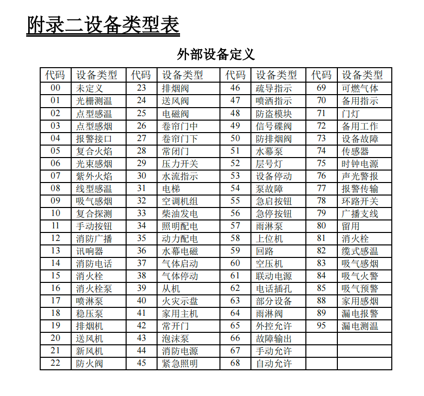

```shell
0x40,0x40,//起始符
0x48,0x00, //流水号
0x01, //主板号
0x01, //用户号
0x2a,0x21,0x0f,0x19,0x09,0x17, //时间
0x01,0x00,0x00,0x00,0x00,0x00, //原地址
0x01,0x00,0x00,0x00,0x00,0x00, //目的地址
0x30,0x00, //数据长度
0x02, //命令字节 02 发送数据
0x02, //类型标识
0x01, //信息对象
0x01, //系统类型
0x01, //系统地址
0x11, //部件类型   ------这个部件类型对应不上
0x2d,0xb8,0x32,0x01, //部件地址
0x03,0x00, //部件状态  低字节在前
0x20,0x20,0x20,0x20,0x20,0x20,0x20,0x20,
0x20,0x20,0x20,0x20,0x20,0x20,0x20,0x20,
0x20,0x20,0x20,0x20,0x20,0x20,0x20,0x20,
0x20,0x20,0x20,0x20,0x20,0x20,0x20,
0x15,0x21,0x0f,0x19,0x09,0x17, //时间
0xa0, //CRC
0x23,0x23, //结束符
// 解析之后数据 2-1-1-#-#-#-17-020101165-#-#-#-#-#-#-1-# true  火警
解析出来的设备部件号是17 和下表对应不上
```

